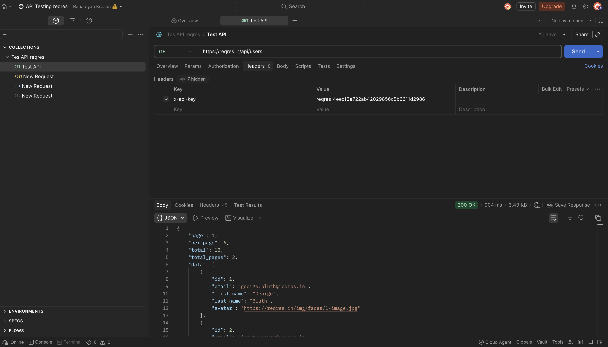
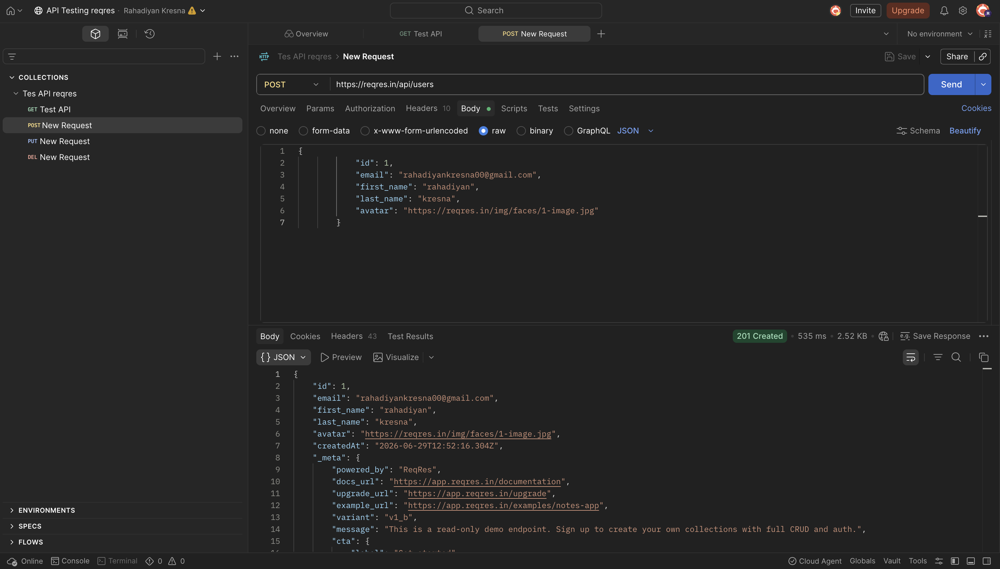
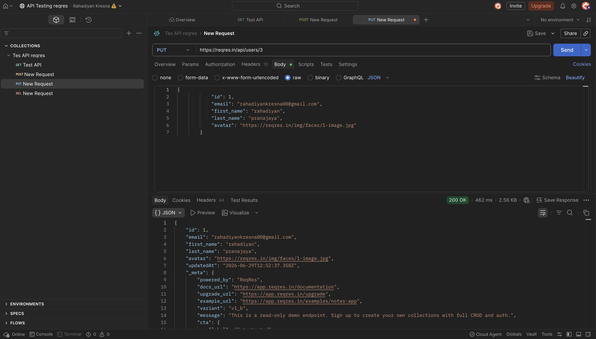
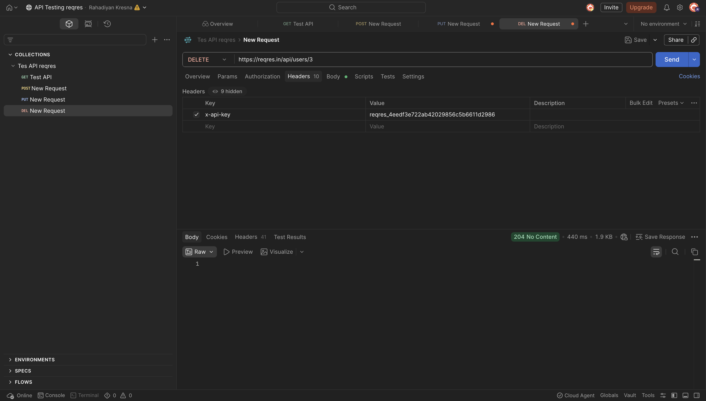
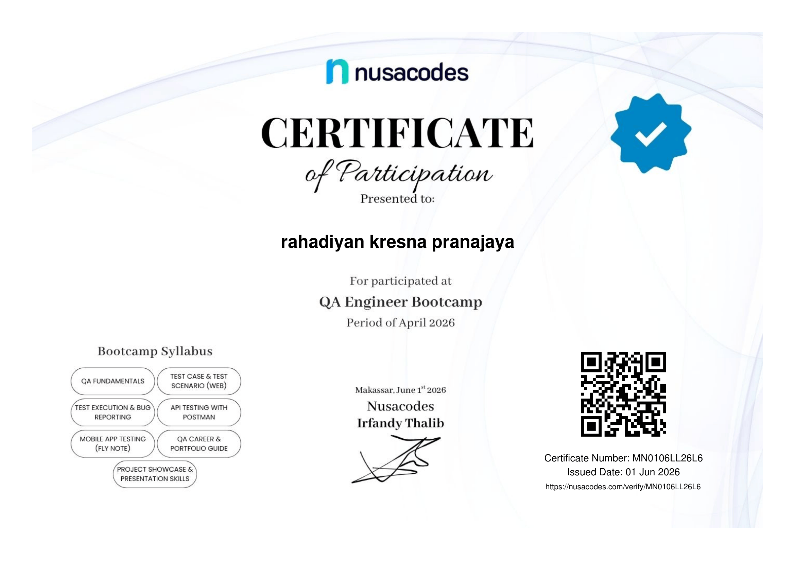

# QA-MANUAL-TESTER-PORTFOLIO

Halo, saya Rahadiyan Kresna Pranajaya.

Saya merupakan lulusan dari Universitas Muhammadiyah Sumatera Utara yang memiliki minat untuk berkarir sebagai QA Manual Tester. 
Repository ini berisi portfolio pembelajaran dan praktik saya dalam melakukan pengujian aplikasi web serta API menggunakan pendekatan manual testing. 

# 🎯 Tujuan Repository 
Repository ini dibuat sebagai portfolio untuk memberitahu kemampuan saya dalam :

# 💻 Kemampuan : 
- Test case design
- Bug reporting
- API Testing menggunakan Postman
- Functional testing
- Positive & Negative testing
- SDLC ( Software Development Life Cycle )
- STLC ( Software Testing Life Cycle )

**Tools**
- Google sheet
- Google docs
- Postman

# 💻 Portfolio Project 
1. **Web Testing**
- [Saucedemo Test Case](https://docs.google.com/spreadsheets/d/19yMKKJ_h3t9ZXWArL3BzuKDpbwsbmaelg8lRY42g2UM/edit?usp=sharing)

**Scope Testing :**
- Login
- Add to cart
- Remove from cart
- Checkout process
- Product sorting
- Sidebar menu
- Home page

2. **API Testing**

API Website : https://reqres.in

**Method tested**
- GET
- POST
- PUT
- DELETE

- **GET USERS**
 
- **POST USERS**

- **PUT USERS**

- **DELETE USERS**
 

**Validation**
- ✅ Status code
- ✅ Response body

3. 🐞**Bug report**
- [Bugs report saucedemo](https://docs.google.com/document/d/1jxFzSzrhuQRkmNix8EK5vf0wMZpLdRcV0P5B8QzxcKE/edit?usp=sharing)

**Certificate**

# 📩 Contact 

Linkedin : https://www.linkedin.com/in/rahadiyankresna/

Email : rahadiyankresna00@gmail.com

No WA : 081269683405
